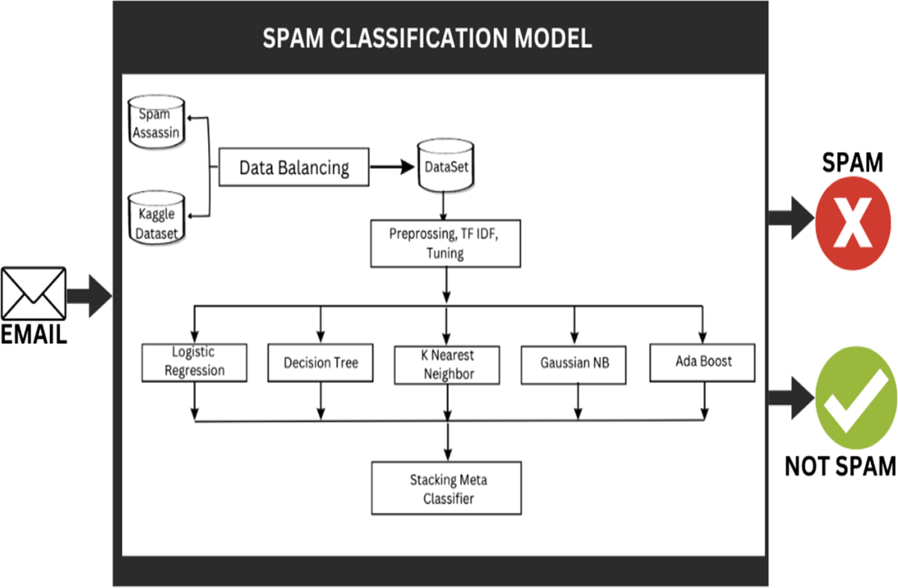
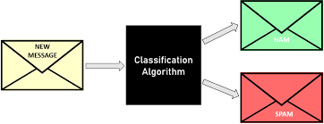

# 📧 Email Spam Classification using Machine Learning

## 📌 Project Overview
Email is one of the most popular and cost-effective methods of online communication, but it is increasingly plagued by **spam**—unwanted messages that waste time and can be malicious.  
This project aims to **classify emails as spam or non-spam** using **Python-based text classification techniques**.

We compare multiple algorithms:
- Support Vector Classifier (SVC)
- K-Nearest Neighbors (KNN)
- Naive Bayes (NB)
- Decision Tree (DT)
- Logistic Regression (LR)
- Random Forest (RF)
- AdaBoost
- Bagging Classifier (Bgc)
- Extra Trees Classifier (ETC)
- Gradient Boosting Decision Trees (GBDT)

Our goal is to **identify the most accurate algorithm** for spam detection.

---

## 🚀 Features
- **Data Preprocessing** (Cleaning, Tokenization, Stopword Removal, Stemming)
- **Feature Engineering** using TF-IDF Vectorization
- **Training & Testing Split** (70% train, 30% test)
- **Multiple ML Algorithms** tested and compared
- **Confusion Matrix** for each model
- **Accuracy & Precision** comparison

---

## 📂 Dataset
We used a Kaggle dataset containing labeled spam and non-spam email messages.  
[Spam Mails Dataset - Kaggle](https://www.kaggle.com/datasets/venky73/spam-mails-dataset)

---

## ⚙️ Tech Stack
- **Language:** Python 3.8
- **Libraries:**  
  - `pandas`, `numpy` (Data handling)  
  - `nltk` (Text preprocessing)  
  - `sklearn` (Machine Learning algorithms & metrics)  
  - `wordcloud`, `matplotlib`, `seaborn` (Data visualization)  

---

## 🛠️ Workflow
1. **Collect Dataset** – From Kaggle.
2. **Data Cleaning & Preprocessing** – Remove duplicates, lowercase conversion, tokenization, remove stopwords/punctuation, stemming.
3. **Feature Engineering** – Convert text into numerical vectors using TF-IDF.
4. **Model Training** – Apply multiple ML classifiers.
5. **Prediction & Evaluation** – Test models on unseen data.
6. **Result Analysis** – Compare accuracy and confusion matrix results.

---

## 📊 Results & Insights
| Algorithm               | Accuracy (%) | Precision (%) |
|------------------------|--------------|---------------|
| SVC                    | 97.93        | 96.88         |
| KNN                    | 95.79        | 94.29         |
| Naive Bayes (NB)       | 94.19        | 87.92         |
| Decision Tree (DT)     | 84.11        | 66.26         |
| Logistic Regression    | 95.33        | 89.94         |
| Random Forest (RF)     | 96.26        | 93.41         |
| AdaBoost               | 95.33        | 91.32         |
| Bagging Classifier     | 94.33        | 89.44         |
| Extra Trees Classifier | 97.46        | 95.58         |
| Gradient Boosting (GBDT)| 92.99       | 91.79         |

**Key Findings:**
- **SVC** achieved the highest accuracy (97.93%), making it the most reliable model for this dataset.
- **Extra Trees Classifier (ETC)** was a close second with 97.46% accuracy and strong precision.
- Decision Tree (DT) had the lowest accuracy, indicating it might be overfitting or underfitting the data.

---

## 📌 Confusion Matrix Example (SVC)
[[1033 14]
[ 17 434]]

- **TN** – True Negatives (correctly predicted non-spam)
- **TP** – True Positives (correctly predicted spam)
- **FP** – False Positives (non-spam predicted as spam)
- **FN** – False Negatives (spam predicted as non-spam)

---

## 📈 Conclusion
This project demonstrates the **effectiveness of machine learning for spam email detection**.  
It shows that careful preprocessing + the right algorithm choice can yield high accuracy for text classification.

  

  

